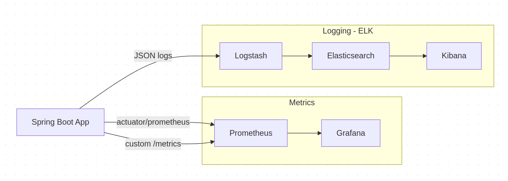
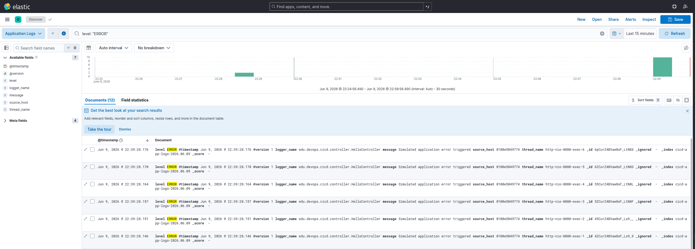
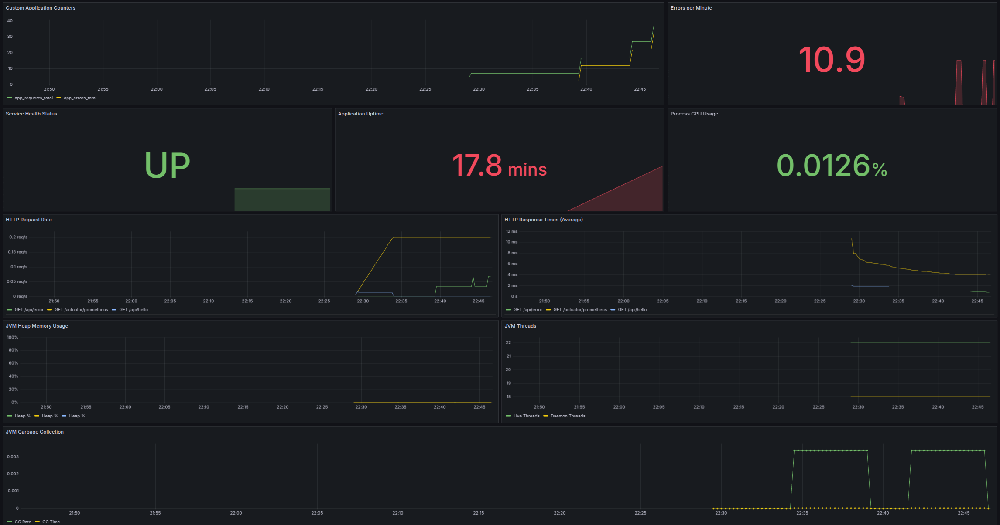
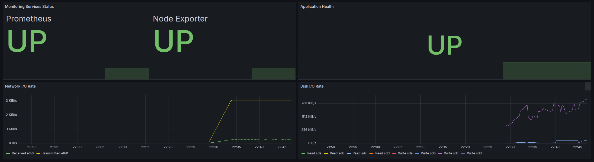
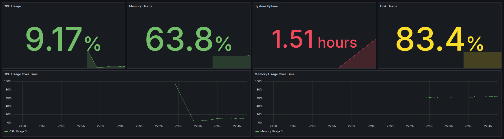
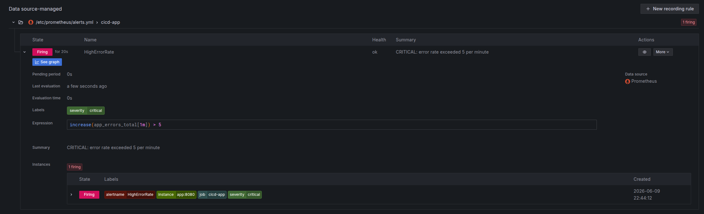

# CI/CD Pipeline - Spring Boot Application

Assignment 1: CI/CD Pipeline Automation and Deployment Strategies

---

## Live Application

The application is deployed and accessible at:

- Hello endpoint: `https://devops-cicd-pnqs.onrender.com/api/hello`
- Health endpoint: `https://devops-cicd-pnqs.onrender.com/api/health`

---

## Screenshots

**Hosted Application**


**Successful GitHub Actions Run**


**Successful deploy on Render**


Screenshots show the application responding correctly on Render and the GitHub Actions workflow completing with both the
Test and Deploy jobs green.

---

## Project Stack

- Java 21, Spring Boot
- Maven (Maven Wrapper included)
- GitHub Actions for CI/CD
- Render (free tier, Docker runtime) for hosting
- Docker for containerization

---

## Pipeline Description

The pipeline is defined in `.github/workflows/main.yml`. It is triggered on two events:

- Every push to the `main` branch (runs both Test and Deploy stages)
- Every pull request targeting the `main` branch (runs Test stage only, no deployment)

**Stage 1 - Test (CI)**

Checks out the code, sets up Java 21, and runs `mvn test`. This stage runs on every push and every pull request to
`main`. If any test fails, the workflow exits immediately and the deploy stage is never reached. This acts as the
quality gate that prevents broken code from being deployed.

**Stage 2 - Deploy (CD)**

Only runs when a commit lands on `main` (direct push or merged pull request) and only if Stage 1 passed. It sends an
HTTP POST request to the Render deploy hook URL stored as a GitHub secret. Render then pulls the latest code, builds the
Docker image, and starts the new container.

This structure means:

- A developer opens a pull request — tests run automatically, deployment does not happen
- The pull request is merged into `main` — tests run again, and if they pass, deployment is triggered automatically
- No manual intervention is needed at any point

**Automation**

The entire pipeline runs without any manual steps. From a code push to a live deployment, everything is handled by
GitHub Actions and Render. The only setup required upfront is adding the `RENDER_DEPLOY_HOOK_URL` secret to the
repository.

**Reliability**

The CI stage correctly blocks broken code. If a test fails, GitHub marks the pipeline as failed and the deploy job is
skipped due to the `needs: test` dependency. This has been verified by intentionally breaking a test and confirming that
the deploy job does not run.

---

## Deployment Strategy

**Chosen strategy: Recreate**

When a new deployment is triggered, Render stops the currently running container and starts a new one from the updated
image. Only one version of the application is ever running at a time.

**Why Recreate was chosen**

Render's free tier only allows a single running instance per service. Strategies like Blue-Green or Rolling Update
require either two parallel environments or multiple instances, which are not available without a paid plan. Recreate is
the only strategy that works within these constraints.

**Implementation steps**

1. The repository includes a `Dockerfile` at the root. Render is configured to use Docker as the runtime environment.
2. When a push to `main` passes CI, the GitHub Actions workflow sends a POST request to the Render deploy hook.
3. Render receives the hook, builds a new Docker image from the latest commit, stops the old container, and starts the
   new one.
4. There is a short period of downtime during the swap (typically a few seconds), which is acceptable for this project.

**Trade-offs**

The main downside of Recreate is the brief downtime window. In a production system with real users, a Rolling Update or
Blue-Green deployment would be preferable. These strategies keep the old version alive until the new one is confirmed
healthy, avoiding any gap in availability. However, they require infrastructure that is not available on the free tier.

---

## Rollback Guide

If a bug is found in the deployed application, the following steps can be used to roll back to the previous stable
version.

**Option A - Render Dashboard (recommended)**

1. Go to the Render dashboard
2. Click the "Deploys" tab in the left sidebar.
3. Find the most recent successful deploy before the broken one. Successful deploys are marked in green.
4. Click the `Redeploy` button next to that deploy entry.
5. Confirm the redeploy action.
6. Render will immediately redeploy that exact Docker image. The rollback typically completes within 1-2 minutes.

**Option B - Git Revert**

If you prefer to fix forward through the pipeline:

1. Identify the commit hash of the last known good state in Git history.
2. Create a new commit that reverts the changes from the bad commit using `git revert <bad-commit-hash>`.
3. Push the new commit to `main`. This will trigger the CI/CD pipeline again, running tests on the reverted code.
4. If the tests pass, the pipeline will automatically deploy the reverted code to Render, effectively rolling back to
   the previous stable version.

---

## Required GitHub Secret

The following secret must be added to the repository under Settings > Secrets and variables > Actions:

| Secret                   | Description                                                           |
|--------------------------|-----------------------------------------------------------------------|
| `RENDER_DEPLOY_HOOK_URL` | Found in Render dashboard under your service > Settings > Deploy Hook |

---

## Local Development

```bash
# Run tests
mvn test

# Start the application
./mvnw spring-boot:run

# Build and run with Docker
docker compose up -d --build
```

---

# Observability

The whole observability stack runs locally with Docker Compose - one command and everything comes up together.
On startup, the `kibana-setup` container creates the **Application Logs** data view in Kibana and hits the app once to seed a few log lines. If Discover looks empty, call `curl http://localhost:8080/api/hello` and refresh.

| Service       | URL                     | Login         |
|---------------|-------------------------|---------------|
| Application   | http://localhost:8080   | -             |
| Prometheus    | http://localhost:9090   | -             |
| Grafana       | http://localhost:3000   | admin / admin |
| Kibana        | http://localhost:5601   | -             |
| Node Exporter | http://localhost:9100   | -             |

Grafana has three provisioned dashboards under the **Observability** folder:

- **Application Services** - custom counters, HTTP/JVM metrics, app health
- **System Overview** - host CPU, memory, disk
- **Infrastructure & Resources** - service status, network and disk I/O

---

## Architecture Diagram



---

## Implementation Details

### Metrics

The app tracks two custom counters in `AppMetrics` using Micrometer:

- `app_requests_total` - goes up on `/api/hello`, `/api/health`, and `/api/error`
- `app_errors_total` - goes up on `/api/error`

There are two ways to read them:

- **`GET /metrics`** - a custom controller I wrote that returns Prometheus text format (required by the assignment)
- **`GET /actuator/prometheus`** - Spring Actuator, which Prometheus actually scrapes for Grafana dashboards (JVM, HTTP, and the same custom counters on top)

You can also browse metrics as JSON at `/actuator/metrics` if you want to inspect a single counter, e.g. `/actuator/metrics/app_requests_total`.

### Logging (ELK)

The app logs in JSON using Log4j2. In Docker, logs also get sent to Logstash over TCP (`logstash:5000`), indexed in Elasticsearch, and viewed in Kibana.

To look at logs in Kibana:

1. Open http://localhost:5601 and go to **Discover**
2. Pick the **Application Logs** data view
3. Filter with `level: ERROR` to see only error lines

### Alerting

A Prometheus rule in `monitoring/prometheus/alerts.yml` fires a **CRITICAL** alert when more than 5 errors happen in one minute:

```yaml
expr: increase(app_errors_total[1m]) > 5
```

The same rule is also provisioned in Grafana's alerting tab.

To trigger it on purpose:

```bash
./scripts/trigger-alert.sh
```

Or just spam the error endpoint:

```bash
for i in $(seq 1 10); do curl -s http://localhost:8080/api/error; done
```

Wait about a minute, then check:

- Prometheus alerts: http://localhost:9090/alerts
- Grafana alerting: http://localhost:3000/alerting/list

---

## Screenshots

**Kibana - filtered JSON logs**


**Grafana dashboard - application services**


**Grafana dashboard - infrastructure and resources**


**Grafana dashboard - system overview**


**Grafana - active alert rule**


---

## Analysis

### Why is JSON-structured logging more efficient than plain text logs?

With JSON, every field (`level`, `message`, `@timestamp`, etc.) has a fixed key, so Logstash and Kibana can index and filter without regex. 
Plain text means writing a separate parser for each log format, and it breaks easily when the message itself contains spaces or special characters. 
Counting errors by service or filtering by level is much harder and slower with unstructured text.

### What is the fundamental technical difference between Prometheus (metrics) and Elasticsearch (logging)?

Prometheus is a time-series database - it stores numbers scraped at regular intervals. It is built for "how many?" and "how fast?" questions, not for storing full log messages.

Elasticsearch is a document store built for search. It indexes entire log records with many text fields and is good at queries like "show me all ERROR logs from the last hour that mention timeout."

So Prometheus tells you the error *rate*; Elasticsearch lets you read the actual error *messages*.

### How would you handle long-term log retention (e.g., 6 months) without depleting disk resources?

1. **Index Lifecycle Management (ILM)** in Elasticsearch - keep recent logs on fast storage, move older ones to cheaper tiers, delete after 6 months
2. **Snapshots to object storage** (S3) before deleting old indices, so you can still restore them if needed
3. **Drop verbose logs sooner** - keep INFO/DEBUG for a week or two, but retain ERROR/WARN longer

---
