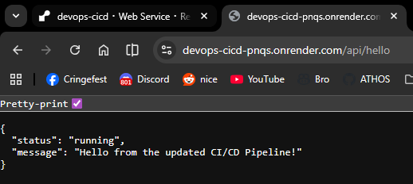
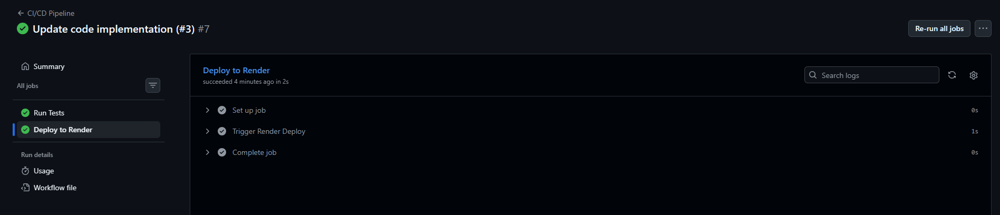
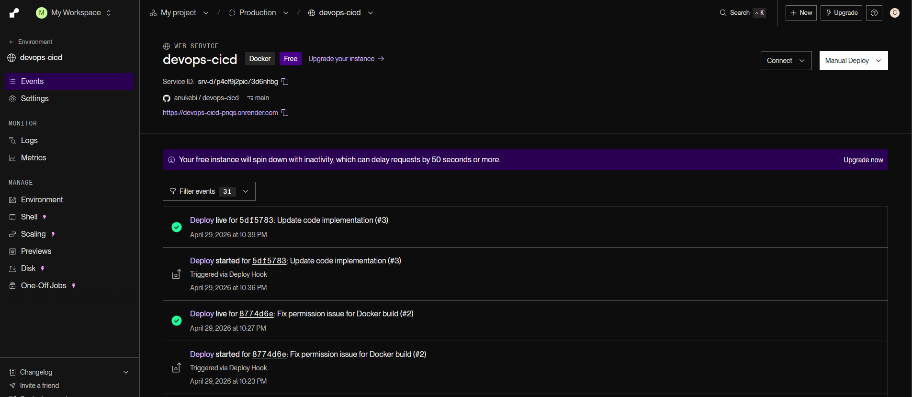

# CI/CD Pipeline - Spring Boot Application

Assignment 1: CI/CD Pipeline Automation and Deployment Strategies

---

## Live Application

The application is deployed and accessible at:

- Hello endpoint: `https://devops-cicd-pnqs.onrender.com/api/hello`
- Health endpoint: `https://devops-cicd-pnqs.onrender.com/api/health`

---

## Screenshots

**Hosted Application**


**Successful GitHub Actions Run**


**Successful deploy on Render**


Screenshots show the application responding correctly on Render and the GitHub Actions workflow completing with both the
Test and Deploy jobs green.

---

## Project Stack

- Java 21, Spring Boot
- Maven (Maven Wrapper included)
- GitHub Actions for CI/CD
- Render (free tier, Docker runtime) for hosting
- Docker for containerization

---

## Pipeline Description

The pipeline is defined in `.github/workflows/main.yml`. It is triggered on two events:

- Every push to the `main` branch (runs both Test and Deploy stages)
- Every pull request targeting the `main` branch (runs Test stage only, no deployment)

**Stage 1 - Test (CI)**

Checks out the code, sets up Java 21, and runs `mvn test`. This stage runs on every push and every pull request to
`main`. If any test fails, the workflow exits immediately and the deploy stage is never reached. This acts as the
quality gate that prevents broken code from being deployed.

**Stage 2 - Deploy (CD)**

Only runs when a commit lands on `main` (direct push or merged pull request) and only if Stage 1 passed. It sends an
HTTP POST request to the Render deploy hook URL stored as a GitHub secret. Render then pulls the latest code, builds the
Docker image, and starts the new container.

This structure means:

- A developer opens a pull request — tests run automatically, deployment does not happen
- The pull request is merged into `main` — tests run again, and if they pass, deployment is triggered automatically
- No manual intervention is needed at any point

**Automation**

The entire pipeline runs without any manual steps. From a code push to a live deployment, everything is handled by
GitHub Actions and Render. The only setup required upfront is adding the `RENDER_DEPLOY_HOOK_URL` secret to the
repository.

**Reliability**

The CI stage correctly blocks broken code. If a test fails, GitHub marks the pipeline as failed and the deploy job is
skipped due to the `needs: test` dependency. This has been verified by intentionally breaking a test and confirming that
the deploy job does not run.

---

## Deployment Strategy

**Chosen strategy: Recreate**

When a new deployment is triggered, Render stops the currently running container and starts a new one from the updated
image. Only one version of the application is ever running at a time.

**Why Recreate was chosen**

Render's free tier only allows a single running instance per service. Strategies like Blue-Green or Rolling Update
require either two parallel environments or multiple instances, which are not available without a paid plan. Recreate is
the only strategy that works within these constraints.

**Implementation steps**

1. The repository includes a `Dockerfile` at the root. Render is configured to use Docker as the runtime environment.
2. When a push to `main` passes CI, the GitHub Actions workflow sends a POST request to the Render deploy hook.
3. Render receives the hook, builds a new Docker image from the latest commit, stops the old container, and starts the
   new one.
4. There is a short period of downtime during the swap (typically a few seconds), which is acceptable for this project.

**Trade-offs**

The main downside of Recreate is the brief downtime window. In a production system with real users, a Rolling Update or
Blue-Green deployment would be preferable. These strategies keep the old version alive until the new one is confirmed
healthy, avoiding any gap in availability. However, they require infrastructure that is not available on the free tier.

---

## Rollback Guide

If a bug is found in the deployed application, the following steps can be used to roll back to the previous stable
version.

**Option A - Render Dashboard (recommended)**

1. Go to the Render dashboard
2. Click the "Deploys" tab in the left sidebar.
3. Find the most recent successful deploy before the broken one. Successful deploys are marked in green.
4. Click the `Redeploy` button next to that deploy entry.
5. Confirm the redeploy action.
6. Render will immediately redeploy that exact Docker image. The rollback typically completes within 1-2 minutes.

**Option B - Git Revert**

If you prefer to fix forward through the pipeline:

1. Identify the commit hash of the last known good state in Git history.
2. Create a new commit that reverts the changes from the bad commit using `git revert <bad-commit-hash>`.
3. Push the new commit to `main`. This will trigger the CI/CD pipeline again, running tests on the reverted code.
4. If the tests pass, the pipeline will automatically deploy the reverted code to Render, effectively rolling back to
   the previous stable version.

---

## Required GitHub Secret

The following secret must be added to the repository under Settings > Secrets and variables > Actions:

| Secret                   | Description                                                           |
|--------------------------|-----------------------------------------------------------------------|
| `RENDER_DEPLOY_HOOK_URL` | Found in Render dashboard under your service > Settings > Deploy Hook |

---

## Local Development

```bash
# Run tests
mvn test

# Start the application
./mvnw spring-boot:run

# Build and run with Docker
docker build -t cicd-app .
docker run -p 8080:8080 cicd-app
```
